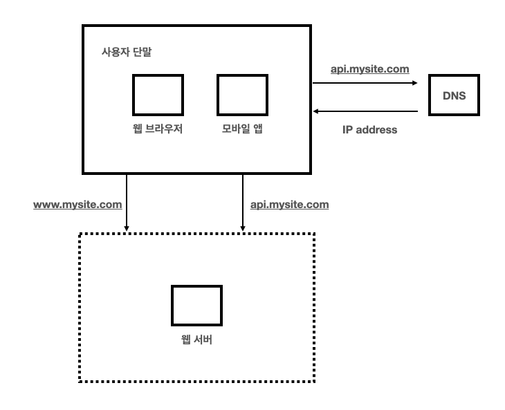
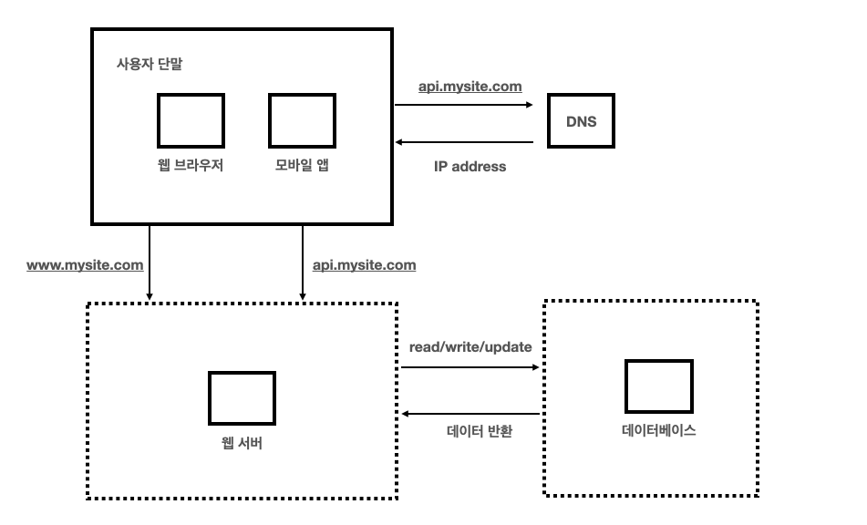
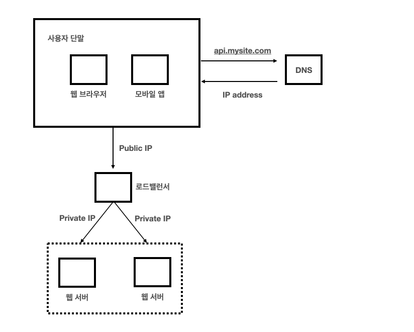
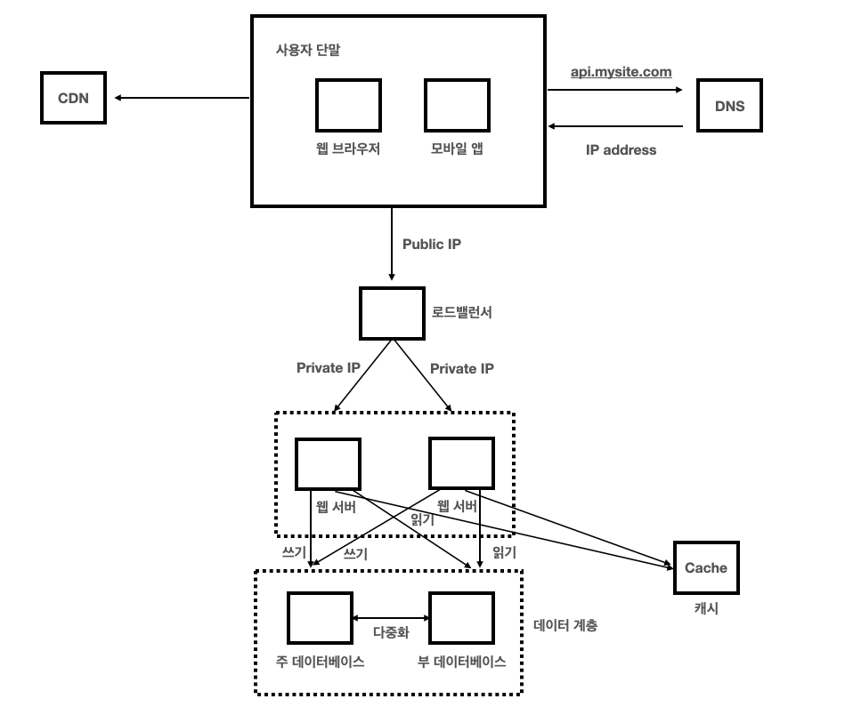
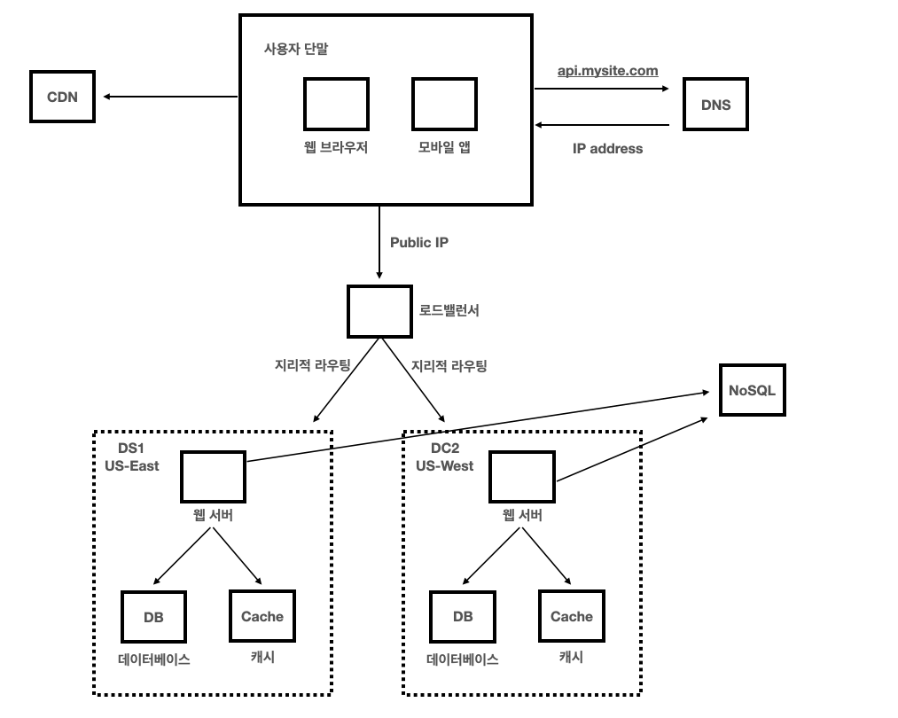
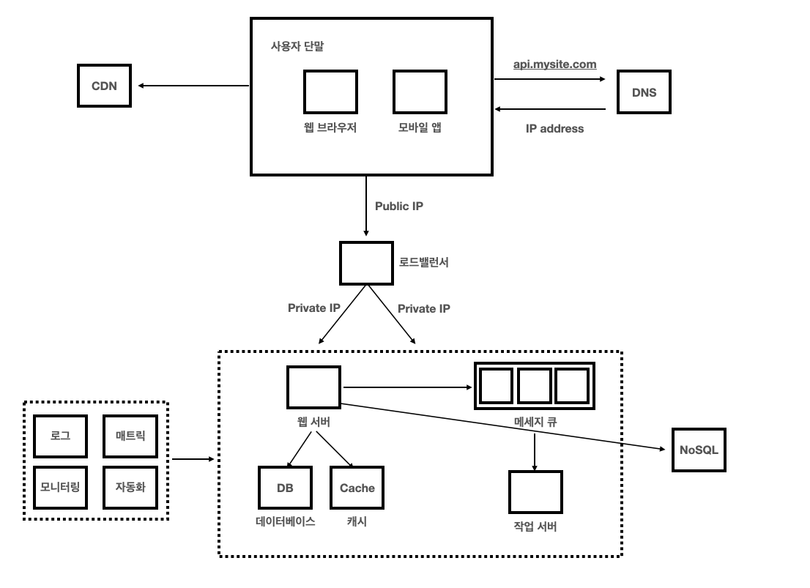

## :pushpin: 가상 면접 사례로 배우는 대규모 시스템 설계 기초

### :seedling: 1장. 사용자 수에 따른 규모 확장성

---

### 단일 서버
- 모든 컴포넌트가 단 한 대의 서버에서 실행되는 간단한 시스템부터 설계해보자
- 웹 앱, 데이터베이스, 캐시 등이 전부 서버 한 대에서 실행된다.

#### 사용자의 요청이 처리되는 과정

1. 사용자는 도메인 이름(api.mysite.com)을 이용하여 웹사이트에 접속한다. 이 접속을 위해서는 도메인 이름을 도메인 이름 서비스(Domain Name Service, DNS)에 질의하여 IP주소로 변환하는 과정이 필요하다.
2. DNS 조회 결과로 IP 주소가 반환된다. (여기서는 15.125.23.214)
3. 해당 IP주소로 HTTP 요청이 전달된다.
4. 요청을 받은 웹 서버는 HTML 페이지나 JSON 형태의 응답을 반환한다. 

### 데이터베이스
- 사용자가 늘면 서버 하나로는 충분하지 않아서 여러 서버를 두어야함
- 하나는 웹/모바일 트래픽 처리 용도고, 다른 하나는 데이터베이스용 

#### 어떤 데이터베이스를 사용할 것인가?
- 전통적인 관계형 데이터베이스(relational database)와 비-관계형 데이터베이스 사이에서 고를 수 있다.
  - RDBMS: MySQL, 오라클 데이터베이스, PostgreSQL 등
  - 관계형 데이터베이스는 자료를 테이블과 열, 칼럼으로 표현함
  - 비관계형 데이터베이스 (NoSQL): CouchDB, Neo4j, Cassandra, HBase, Amazon DynomoDB 등
  - NoSQL은 키-값 저장소, 그래프 저장소, 칼럼 저장소, 문서 저장소로 분류할 수 있음
- 아래와 같은 경우에는 비관계형 데이터베이스(NoSQL)이 바람직할 수 있다.
  - 아주 낮은 응답 지연시간(latency)이 요구됨
  - 다루는 데이터가 비정형이라 관계형 데이터가 아님
  - 데이터(JSON, YAML, XML 등)를 직렬화하거나 역직렬화할 수 있기만 하면 됨
  - 아주 많은 양의 데이터를 저장할 필요가 있음

#### 수직적 규모 확장 vs 수평적 규모 확장
1. 스케일 업(scale up): 서버에 고사양 자원 (더 좋은 CPU, 더 많은 RAM 등)을 추가하는 행위
2. 스케일 아웃(scale out): 더 많은 서버를 추가하여 성능을 개선하는 방법

> 대규모 애플리케이션을 지원하는데는 스케일 아웃이 보다 적절하다.

### 로드밸런서

- 부하 분산 집합 (load balancing set)에 속한 웹 서버들에게 트래픽 부하를 고르게 분산시켜준다.

#### flow
1. 사용자는 로드밸런서의 공개 IP 주소 (public IP address)로 접속한다. 따라서 웹 서버는 클라이언트의 접속을 직접 처리하지 않는다.
2. 로드밸런서는 웹 서버와 통신하기 위해 사설 IP 주소를 이용한다.
   - 사설 IP 주소: 같은 네트워크에 속한 서버 사이의 통신에만 쓰일 수 있는 IP 주소로 인터넷을 통해서는 접속할 수 없다.
3. 서버 1이 다운되면 모든 트래픽은 서버 2로 전송된다. 따라서 웹 사이트 전체가 다운되는 일이 방지된다.
4. 웹사이트로 유입되는 트래픽이 가파르게 증가하면 두 대의 서버로 트래픽을 감당할 수 없는 시점이 온다. 
5. 웹 서버 계층에 더 많은 서버를 추가하면 로드밸런서가 자동적으로 트래픽을 분산하기 시작할 것이다.

> 부하 분산 집합에 또 하나의 웹 서버를 추가하고 나면 장애를 자동복구하지 못하는 문제(no failover)는 해소되며 웹 계층의 가용성은 향상된다.

### 데이터베이스 다중화
- 많은 데이터베이스 관리시스템이 다중화를 지원한다.
- 다중화: 보통은 서버 사이에 `주(master)` - `부(slave)` 관계를 설정하고 데이터 원본은 주 서버에 사본은 부 서버에 저장하는 방식
  - 쓰기 연산은 마스터에서만 지원한다.
  - 부 데이터베이스는 주 데이터베이스로부터 그 사본을 전달받으며 읽기 연산만을 지원한다.
- 데이터베이스 다중화 장점
  - 더 나은 성능
  - 안정성
  - 가용성

### 캐시 
- 캐시: 값비싼 연산 결과 또는 자주 참조되는 데이터를 메모리 안에 두고, 뒤이은 요청이 보다 빨리 처리될 수 있도록 하는 저장소다.
- 캐시 사용 시 유의할 점
  - 캐시는 어떤 상황에 바람직한가?
    - 데이터 갱신은 자주 일어나지 않지만 참조는 빈번하게 일어난다면 고려해볼만하다.
  - 어떤 데이터를 캐시에 두어야하는가?
    - 캐시는 데이터를 휘발성 메모리에 두므로 영속적으로 보관할 데이터를 캐시에 두는 것은 바람직하지 않다.
  - 캐시에 보관된 데이터는 어떻게 만료되는가?
    - 만료 정책이 없으면 데이터는 캐시에 계속 남게 된다.
  - 일관성은 어떻게 유지되는가?
    - 일관성은 데이터 저장소의 원본과 캐시 내의 사본이 같은지 여부다.

### 콘텐츠 전송 네트워크 (CDN)
- CDN은 정적 콘텐츠를 전송하는데 쓰이는 지리적으로 분산된 서버의 네트워크
- 이미지, 비디오, CSS, JavaScript 파일 등을 캐시할 수 있다.

#### flow
1. 사용자 A가 이미지 URL을 이용해 image.png에 접근한다. URL의 도메인은 CDN 서비스 사업자가 제공한 것이다.
2. CDN 서버의 캐시에 해당 이미지가 없는 경우 서버는 원본(origin) 서버에 요청하여 파일을 가져온다. 원본 서버는 웹 서버일 수도 있고 아마존 S3 같은 온라인 저장소일 수도 있다.
3. 원본 서버가 파일을 CDN 서버에 반환한다. 
4. CDN 서버는 파일을 캐시하고 사용자 A에게 반환한다. 이미지는 TTL에 명시된 시간이 끝날 때까지 캐시된다.
5. 사용자 B가 같은 이미지에 대한 요청을 CDN 서버에 전송한다.
6. 만료되지 않은 이미지에 대한 요청은 캐시를 통해 처리된다.

아래 그림은 CND과 캐시가 추가된 설계다.

1. 정적 콘텐츠 (JS, CSS, 이미지 등)는 더이상 웹 서버를 통해 서비스하지 않으며 CDN을 통해 제공하여 더 나은 성능을 보장한다.
2. 캐시가 데이터베이스 부하를 줄여준다.

### 무상태(stateless) 웹 계층

#### 상태 정보 의존적인 아키텍처
- 상태 정보를 보관하는 서버는 클라이언트 정보, 즉 상태를 유지하여 요청들 사이에 공유되도록 한다.
  - 사용자 A -> 서버1 (사용자 A에 대한 세션 데이터)
  - 사용자 B -> 서버2 (사용자 B에 대한 세션 데이터)
  - 사용자 C -> 서버3 (사용자 C에 대한 세션 데이터)
- 같은 클라이언트로부터의 요청은 항상 같은 서버로 전송되어야 한다.
- 대부분의 로드밸런서가 이를 지원하기 위해 고정 세션(sticky session) 기능을 제공하지만 이는 로드밸런서에 부담을 준다.

#### 무상태 아키텍처
- 웹 서버는 상태 정보가 필요할 경우 공유 저장소(shared storage)로부터 데이터를 가져온다.
- 따라서 상태 정보는 웹 서버로부터 물리적으로 분리되어 있다.
- 이런 구조는 단순하고 안정적이며 규모 확장이 쉽다.

### 데이터센터
- 아래 그름은 두 개의 데이터 센터를 이용하는 사례다.
- 장애가 없는 상황에서 사용자는 가장 가까운 데이터 센터로 안내된다. 이를 지리적 라우팅이라고 한다.
- 이들 데이터센터 중 하나에 심각한 장애가 발생하면 모든 트래픽은 장애가 없는 데이터 센터로 전송된다. 

### 메시지 큐
- 메시지 큐: 메시지의 무손실을 보장하는 비동기 통신을 지원하는 컴포넌트

#### flow
1. 생산자 또는 발행자(producer/publisher)라고 불리는 입력 서비스가 메시지를 만들어 메시지 큐에 발행한다.
2. 큐에는 보통 소비자 혹은 구독자(consumer/subscriber)라 불리는 서비스 혹은 서버가 연결되어 있다.
3. 메시지를 받아 그에 맞는 동작을 수행하는 역할을 한다.

> ex) 이미지의 크로핑, 샤프닝, 블러링 등을 지원하는 사진 보정 애플리케이션이 있다. 이러한 보정은 시간이 오래 걸릴 수 있는
> 프로세스이므로 비동기적으로 처리하면 편리하다.

### 로그, 메트릭 그리고 자동화

- 아래는 로그, 메트릭, 자동화와 메시지 큐를 적용하여 수정한 설계안이다.
- 메시지 큐는 각 컴포넌트가 보다 느슨히 결합(loosely coupled)될 수 있도록 하고 결함에 대한 내성을 높인다.
- 로그, 모니터링, 메트릭, 자동화 등을 지원하기 위한 장치를 추가하였다.

### 백만 사용자 그리고 그 이상
- 1장에서 시스템 규모 확장을 위해 살펴본 기법들을 정리하면 아래와 같다.

1. 웹 계층은 무상태 계층으로
2. 모든 계층에 다중화 도입
3. 가능한 한 많은 데이터를 캐시할 것
4. 여러 데이터 센터를 지원할 것
5. 정적 콘텐츠는 CDN을 통해 서비스할 것
6. 데이터 계층은 샤딩을 통해 그 규모를 확장할 것
7. 각 계층은 독립적 서비스로 분할할 것
8. 시스템을 지속적으로 모니터링하고 자동화 도구들을 활용할 것 
