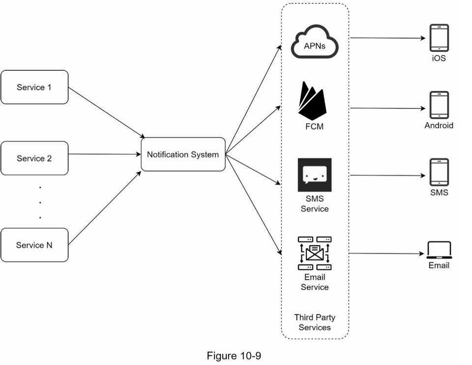
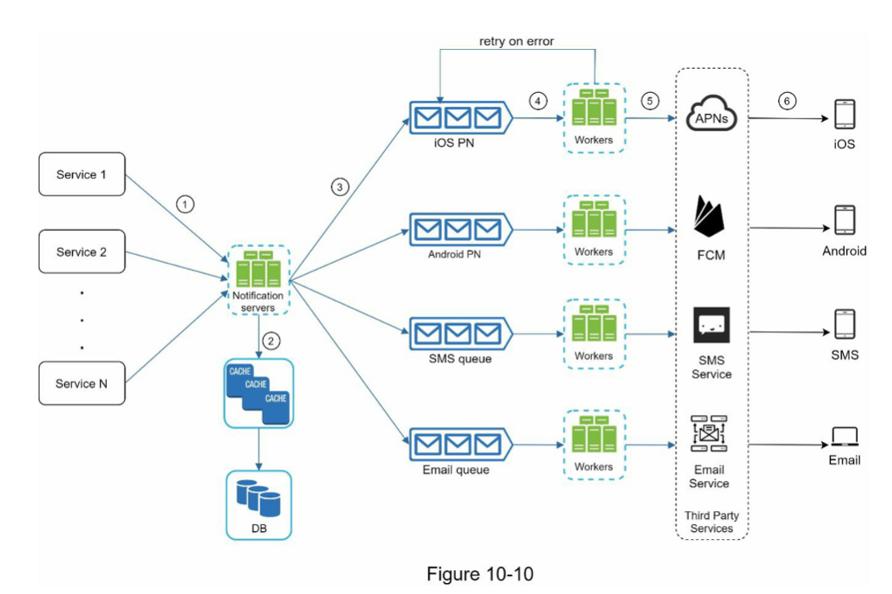
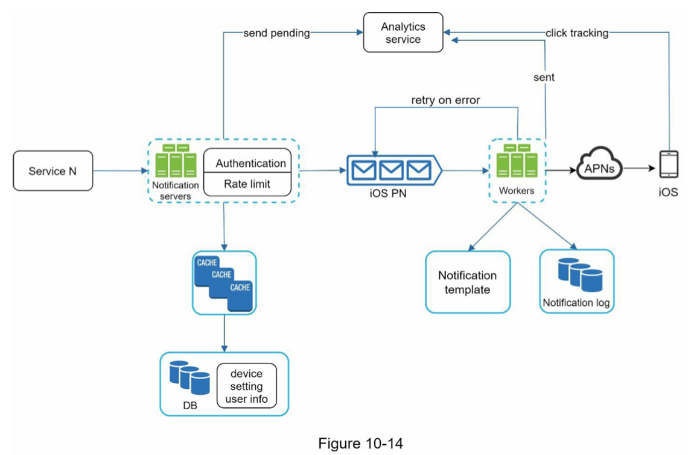

# :pushpin: 10장 알림 시스템 설계

## 알림 시스템 설계
알림 시스템(notification system)은 최근 많은 프로그램이 채택한 인기 있는 기능이다.
이 기능을 갖춘 애플리케이션 프로그램은 최신 뉴스, 제품 업데이트, 이벤트, 선물 등 고객에게 중요할 만한 정보를 비동기적으로 제공한다.

알림 시스템은 모바일 푸시 알림, SMS 메시지, 그리고 이메일의 세 가지로 분류할 수 있다.

### 1단계: 문제 이해 및 설계 범위 확정
- 하루에 백만건 이상의 알림을 처리해야 한다.
- 푸시 알림, SMS 메시지, 이메일 지원
- 연성 실시간 시스템 (soft real-time): 알림은 가능한 빨리 전달되어야 하지만 시스템에 높은 부하가 걸렸을 때 약간의 지연은 무방
- 천 만건의 모바일 푸시 알림 / 백만 건의 SMS 메시지 / 5백만 건의 이메일을 보낼 수 있어야 한다.

### 2단계: 개략적 설계안 제시 및 동의 구하기
- iOS 푸시 알림, 안드로이드 푸시 알림, SMS 메시지 그리고 이메일을 지원하는 알림 시스템의 개략적 설계안

#### 알림 유형별 지원 방안

iOS 푸시 알림
- iOS에서 푸시 알림을 보내기 위해서는 3가지 컴포넌트가 필요
  - 알림 제공자(provider): 알림 요청을 만들어 애플 푸시 알림 서비스(APNS)로 보내는 주체. 알림 요청을 만들려면 단말 토큰(device token)과 페이로드(payload)가 필요하다.
  - APNS: 애플이 제공하는 원격 서비스. 푸시 알림을 iOS 장치로 보내는 역할을 한다.
  - iOS 단말: 푸시 알림을 수신하는 사용자 단말

안드로이드 푸시 알람
- 안드로이드 푸시 알람과 비슷한 절차로 전송됨. APNS 대신 FCM을 사용한다.

SMS 메시지
- 트윌리오(Twilio), 넥스모(Nexmo) 같은 제3사업자의 서비스를 많이 이용함

이메일
- 센드그리드, 메일침프 등

### 개략적 설계안 (초안)

- 1부터 N까지의 서비스
- 알림 시스템
- 제3자 서비스

이 설계에는 몇가지 문제가 있다.
- SPOF(Single-Point-of-Failure): 알림 서비스에 서버가 하나밖에 없다는 것은 그 서버에 장애가 생기면 전체 서비스의 장애로 이어진다.
- 규모 확장성: 한 대 서비스로 푸시 알림에 관계된 모든 것을 처리하므로 데이터베이스나 캐시 등 중요 컴포넌트의 규모를 개별적으로 늘릴 방법이 없다. 
- 성능 병목: 모든 것을 한 서버로 처리하면 사용자 트래픽이 많이 몰리는 시간에 시스템이 과부하 상태에 빠질 수 있다.

### 개략적 설계안 (개선 버전)
위 설계안을 아래와 같이 개선해보았다.

- 데이터베이스와 캐시를 알림 시스템의 주 서버에서 분리
- 알림 서버를 증설하고 자동으로 수평적 규모 확장이 이루어질 수 있도록 한다.
- 메시지 큐를 이용해 시스템 컴포넌트 사이의 강한 결합을 끊는다.

1. API를 호출하여 알림 서버로 알림을 보낸다.
2. 알림 서버는 사용자 정보, 단말 토큰, 알림 설정 같은 메타데이터를 캐시나 데이터베이스에서 가져온다.
3. 알림 서버는 전송할 알림에 맞는 이벤트를 만들어서 해당 이벤트를 위한 큐에 넣는다. 가령 iOS 푸시 알림 이벤트는 iOS 푸시 알림 큐에 넣어야 한다.
4. 작업 서버는 메시지 큐에서 알림 이벤트를 꺼낸다.
5. 작업 서버는 알림을 제3자 서비스로 보낸다.
6. 제3자 서비스는 사용자 단말로 알림을 전송한다.

### 상세 설계
- 안정성
  - 데이터 손실 방지
  - 알림 중복 전송 방지
- 추가로 필요한 컴포넌트 및 고려사항
  - 알림 템플릿
  - 알림 설정
  - 전송률 제한
  - 재시도 방법
  - 푸시 알림과 보안
  - 큐 모니터링
  - 이벤트 추적

위와 같은 사항을 모두 반영하여 수정한 설계안이 아래 그림이다. 

