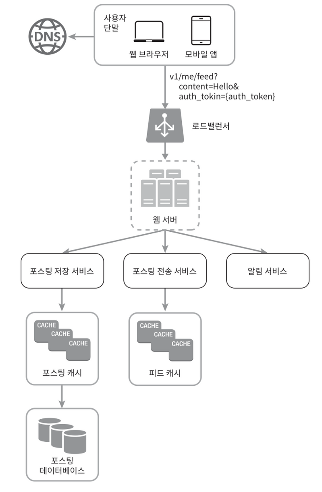
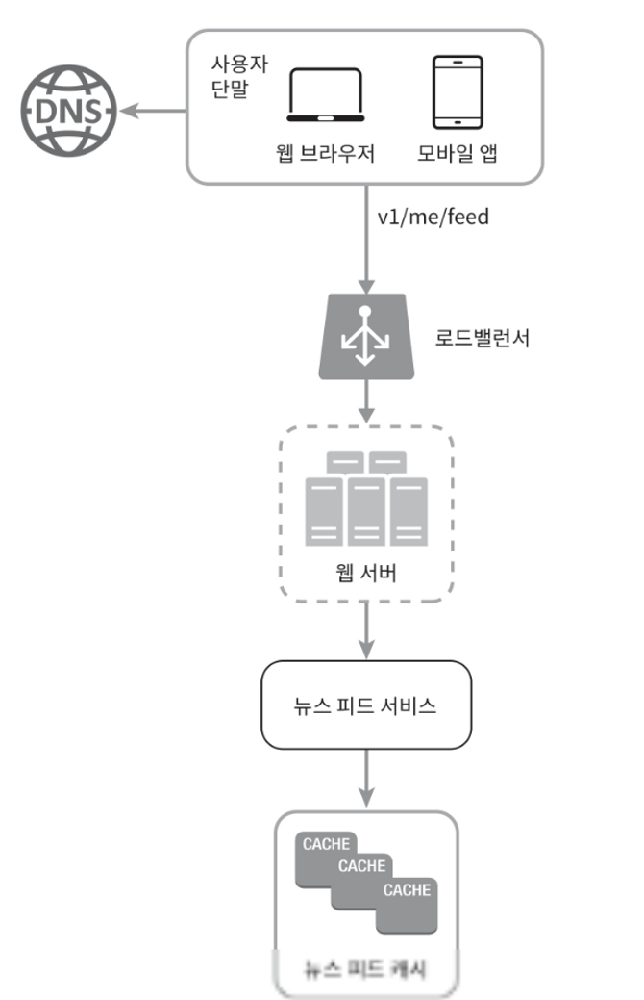
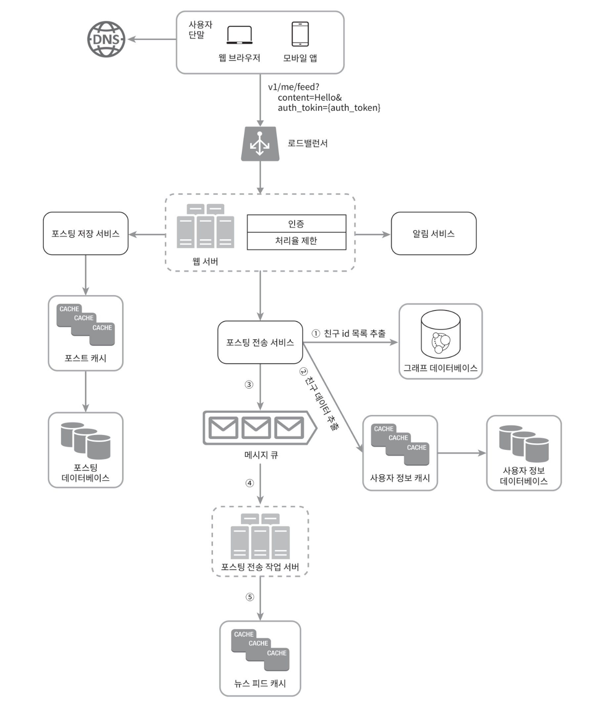

# :pushpin: 11장 뉴스 피드 시스템 설계

## 뉴스 피드 시스템 설계
뉴스피드는 여러분의 홈 페이지 중앙에 지속적으로 업데이트되는 스토리들로 사용자 상태 정보 업데이트,
사진, 비디오, 링크, 앱 활동(app activity), 그리고 여러분이 페이스북에서 팔로하는 사람들, 페이지,
또는 그룹으로부터 나오는 '좋아요' 등을 포함한다.

## 1단계 문제 이해 및 설계 범위 확정
- 모바일 앱과 웹 둘 다 지원
- 사용자는 뉴스 피드 페이지에 새로운 스토리를 올릴 수 있어야 함
- 친구들이 올리는 스토리를 볼 수 있어야 함
- 뉴스 피드에는 시간 흐름 역순으로 스토리가 표시됨
- 한 명의 사용자는 최대 5000명의 친구를 가질 수 있다.
- 트래픽 규모는 매일 천만명이 방문한다고 가정
- 스토리에는 이미지나 비디오 파일이 포함될 수 있다.


## 2단계 개략적 설계안 제시 및 동의 구하기
1. 피드 발행: 사용자가 스토리를 포스팅하면 해당 데이터를 캐시와 데이터베이스에 기록한다. 새 포스팅은 친구의 뉴스피드에도 전송된다.
2. 뉴스 피드 생성: 뉴스 피드는 모든 친구의 포스팅을 시간 흐름 역순으로 모아서 만든다고 가정한다.

### 뉴스 피드 API
- 뉴스 피드 API는 클라이언트가 서버와 통신하기 위해 사용하는 수단
- HTTP 프로토콜 기반이고 상태 정보를 업데이트하거나 뉴스 피드를 가져오거나 친구를 추가하는 등의 다양한 작업을 하는데 수행됨


```
피드 발행 API (새 스토리를 포스팅하기 위한 API)

POST /v1/me/feed

인자: 
바디(body): 포스팅 내용에 해당
Authorization 헤더: API 호출을 인증하기 위해 사용함
```

```
피드 읽기 API (뉴스 피드를 가져오는 API)

GET /v1/me/feed

인자:
Authorization 헤더: API 호출을 인증하기 위해 사용함
```


### 피드 발행



- 사용자: 모바일 앱이나 브라우저에서 새 포스팅을 올리는 주체. POST /v1/me/feed API를 사용
- 로드밸런서(load balancer): 트래픽을 웹 서버들로 분산한다
- 웹 서버: HTTP 요청을 내부 서비스로 중계하는 역할을 담당
- 포스팅 저장 서비스(post service): 새 포스팅을 데이터베이스와 캐시에 저장한다.
- 포스팅 전송 서비스(fanout service): 새 포스팅을 친구의 뉴스피드에 푸시한다. 뉴스 피드 데이터는 캐시에 보관하여 빠르게 읽어갈 수 있도록 한다.
- 알림 서비스: 친구들에게 새 포스팅이 올라왔음을 알리거나 푸시 알림을 보내는 역할 


### 뉴스 피드 생성
사용자가 보는 뉴스 피드가 어떻게 만들어지는지 설계



- 사용자: 뉴스 피드를 읽는 주체. GET /v1/me/feed API를 이용
- 로드 밸런서: 트래픽을 웹 서버들로 분산
- 웹 서버: 트래픽을 뉴스 피드 서비스로 보냄
- 뉴스 피드 서비스: 캐시에서 뉴스 피드를 가져오는 서비스
- 뉴스피드 캐시: 뉴스 피드를 렌더링할때 필요한 피드 ID를 보관


## 3단계 상세 설계
