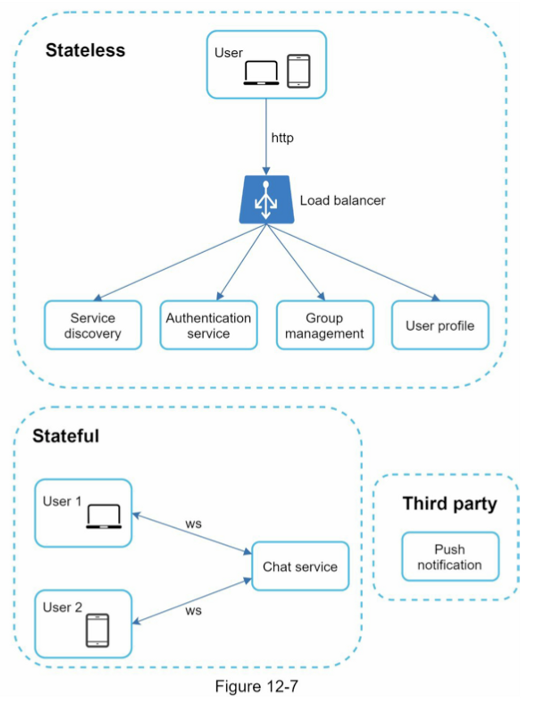
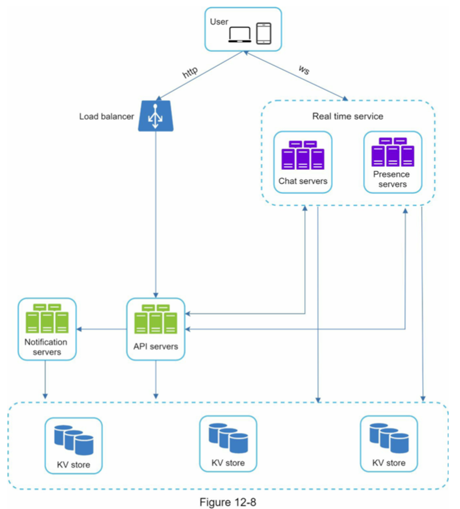
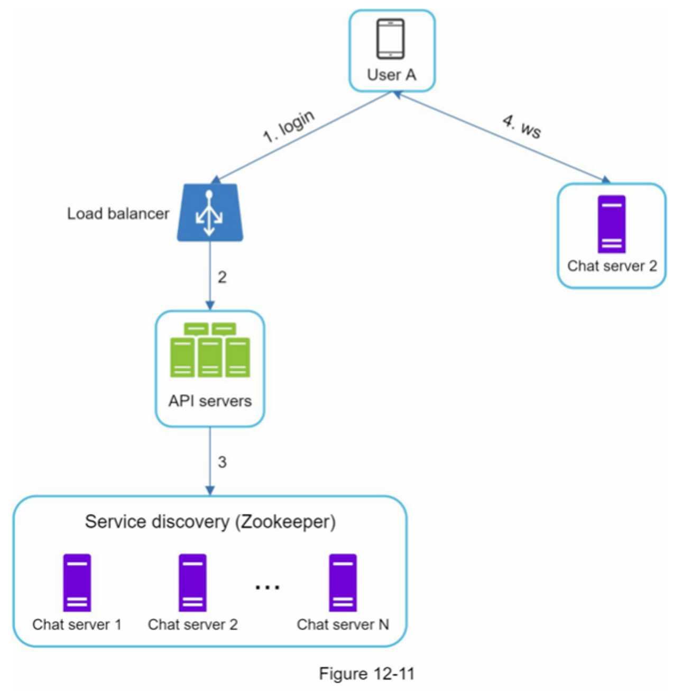
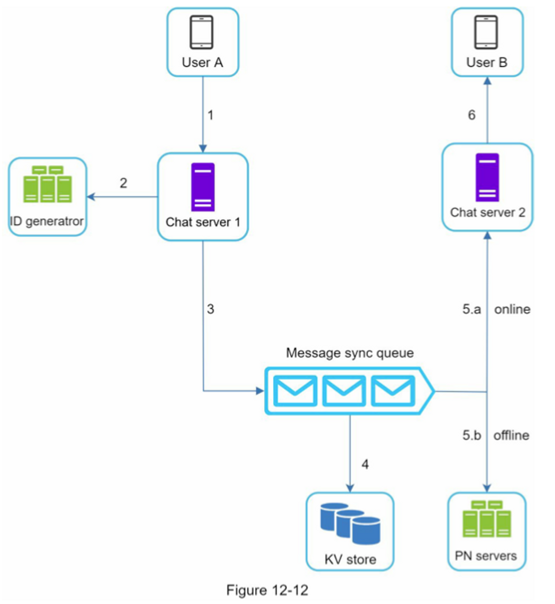
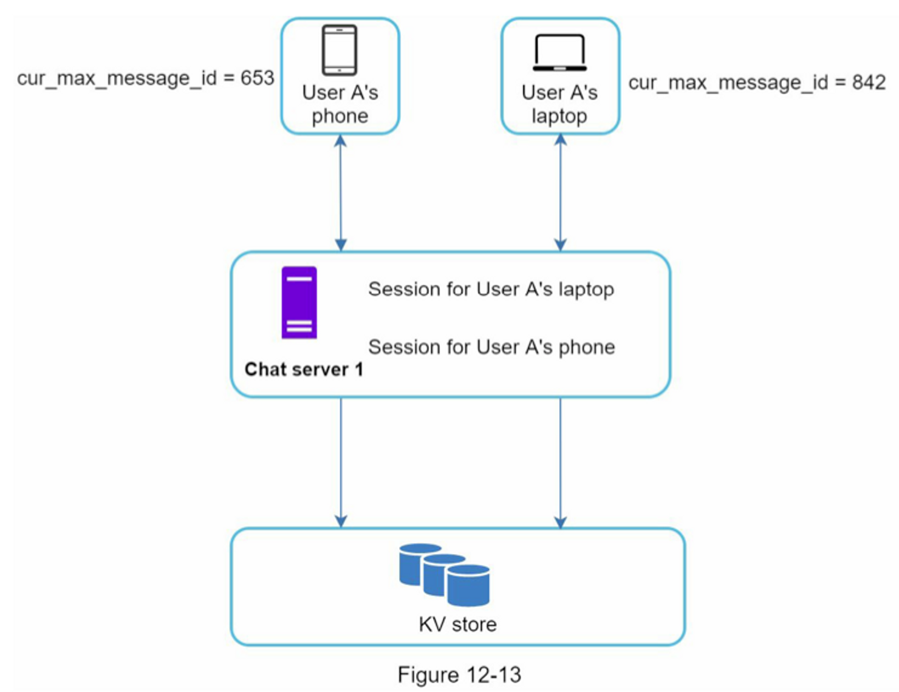

## 12장: 채팅 시스템 설계

### 문제 이해 및 설계 범위 확정

```
- 응답지연이 낮은 일대일 채팅 기능
- 최대 100명 까지 참여할 수 있는 그룹 채팅 기능
- 사용자의 접속상태 표시 기능
- 다양한 단말 지원, 하나의 계정으로 여러 단말에 동시 접속 지원
- 푸시 알림
- DAU 5천만
```

### 개략적 설계안 제시 및 동의 구하기

**채팅서비스가 제공하는 기능**

- 클라이언트들로 부터 메시지 수신
- 메시지 수신자(recipient) 결정 및 전달
- 수신자가 접속(online) 상태가 아닌 경우에는 접속할 때까지 해당 메시지 보관


**Sender Protocol**

- HTTP 프로토콜 + keep-alive 헤더
    - 클라이언트와 서버 사이의 연결을 끊지 않고 계속 유지할 수 있다.
    - TCP 접속 과정에서 발생하는 핸드세이크(hand-shake) 횟수를 줄일 수 있다.

**Receiver Protocol**


|    | 설명 | 단점 |
|:--:|:--|:--|
|폴링 | 클라이언트가 주기적으로 서버에게 메시지 여부를 물어보는 방식<br>폴링 비용은 주기가 짧을 수록 올라간다.|답할 메시지가 없을 경우 서버 자원이 낭비된다|
|롱폴링|새 메시지가 반환되거나 타임아웃 될 때까지 연결을 유지한다. <br>클라이언트는 새 메시지를 받거나 타임아웃 시 기존 연결을 종료하고 서버에 새로운 요청을 보내 모든 절차를 다시 시작한다| - 송신자와 수신자가 같은 채팅 서버에 접속하지 않을 수 있다.<br>- HTTP 서버들은 대부분 stateless 서버이며, 로드 밸러싱을 위해 라운드 로빈 알고리즘을 사용하는 경우, 송신자와 수신자가 다른 채팅 서버를 사용할 수 있다.<br>- 서버 입장에서 연결 해제 여부를 알 수 없다.<br>- 메시지를 받지않은 클라이언트도 타임아웃이 일어날 때마다 주기적으로 서버에 재접속해야하므로 여전히 비효율적이다.|
|웹소켓|- 웹 소켓은 서버가 클라이언트에게 비동기 메시지를 보낼 때 가장 널리 사용하는 기술이다.<br>연결은 클라이언트가 시작하며, 첫 HTTP 연결 및 특정 handshake 후 웹소켓 연결로 업그레이드된다<br> 웹 소켓 연결은 **항구적이며 양방향**이다.<br>HTTP/HTTPS의 80 또는 443 포트를 그대로 사용하기 때문에 방화벽 환경에서도 동작한다.|


**개략적인 설계안**



- 채팅을 제외한 대부분의 기능(회원가입, 로그인, 사용자 프로필 등)은 일반적인 HTTP로 구현 가능
- 채팅 시스템은 세 부분으로 구분

|  상태  | 서비스  | 비고 |
|:--:|:--|:--|
|stateless | 로그인, 회원가입, 사용자 프로필 등 전통적인 요청/응답|무상태 서비스는 로드밸런서 뒤에 위치하며, 모놀리틱 또는 마이크로서비스일 수도 있다<br>service discovery 서비스는 클라이언트가 접속할 채팅 서버의 DNS 호스트명을 알려주는 서비스|
|stateful | 채팅 | 각 클라이언트와 채팅 서버는 독립적인 네트워크 연결을 유지해야한다.<br>클라이언트는 서버와 연결이 살아있는 한 다른 서버로 연결을 변경하지 않는다.<br>service discovery 서비스는 채팅 서비스와 협력하여 특정 채팅 서버에 부하가 몰리지 않도록 한다|
|third-party 연동| 푸시 알림 |앱이 실행 중이 아니어도 알림을 받아야한다


**규모 확장성**


- 
- 실시간 메시지 통신을 위해 클라이언트는 채팅 서버와 웹 소켓 연결을 끊지 않고 유지해야함
- 채팅 서버 : 클라이언트 사이에 메시지를 중계하는 역할
- 접속 상태 서버(presence server) : 사용자의 접속 여부 관리
- API 서버 : 로그인, 회원가입, 프로파일 변경 등 채팅 외 나머지 전부를 처리
- 알림 서버 : 푸시 알림 전송
- 키-값 저장소 : 채팅 이력 보관

### 상세 설계

**서비스 탐색**




- 클라이언트에게 가장 적합한 채팅 서버를 추천하는 것
- 기준은 클라이언트의 위치, 서버 용량 등이 있다.
- 대표적으로는 아파치 주키퍼 등등
- 사용가능한 모든 채팅 서버를 등록하고 클라이언트가 접속 시도 시, 기준에 따라 최적의 채팅 서버를 골라준다.


**메시지 흐름**



1. 사용자 A가 채팅 서버 1로 메시지 전송
2. 채팅 서버 1은 ID 생성기를 사용해 해당 메시지의 ID 결정
3. 채팅 서버 1은 해당 메시지를 메시지 동기화 큐로 전송
4. 메시지가 키-값 저장소에 보관
   (a) 사용자 B가 접속 중인 경우 메시지는 사용자 B가 접속 중인 채팅 서버로 전송됨
   (b) 사용자 B가 접속 중이 아니라면 푸시 알림 메시지를 푸시 알림 서버로 보냄
5. 채팅 서버2는 메시지를 사용자 B에게 전송, 사용자 B와 채팅 서버 2 사이에는 웹소켓 연결이 있는 상태이므로 그것을 이용

**여러 단말 사이의 메시지 동기화**



- 각 단말은 가장 최신 메시지 ID인 cur_max_message_id를 갖는다.
- 아래 두 조건을 만족한 경우 새 메시지로 간주한다.
    - 수신자 ID가 현재 로그인한 사용자 ID와 같은 경우
    - message_id가 cur_max_message_id보다 큰 경우


**소규모 그룹 채팅**


- A가 보낸 메시지는 B와 C의 메시지 큐에 복사된다
- 새 메시지 여부는 본인 큐만 확인하면 되므로 단순하다
- 그룹이 크지않으면 큐마다 복사하는 비용이 문제되지 않는다
- 위챗은 이 방법을 쓰며 그룹 크기를 500명으로 제한


- 수신자 관점으로 보면 수신자는 여러 송신자에서 오는 메시지를 수신할 수 있어야한다.
- 즉, 메시지 큐는 여러 사용자의 메시지를 받을 수 있어야한다.

**접속상태 표시 - 사용자 로그인**


클라이언트와 실시간 서비스 사이에 웹 소켓 연결이 맺어지고 나면 접속 상태 서버는 A의 상태와 last_active_at 타임스탬프 값을 키-값 저장소에 보관한다.

**접속상태 표시 -로그아웃**


사용자가 로그아웃을 하면 API가 접속 상태 서버에 정보를 전달해주고 키-값 저장소에 유저 상태 정보를 offline으로 변경한다.

**접속 장애**


- 인터넷 연결은 항상 안정적인 것은 아니다.
- 잠깐의 연결이 끊겼다고 매번 접속 상태를 변경하는 것은 오버헤드가 크다. ex) 터널
- heartbeat 검사를 통해 해결 가능
- 클라이언트는 주기적으로 heartbeat event를 접속상태 서버로 보낸다.
- 마지막 이벤트가 x초 이내에 다시 오면 온라인으로 유지하고 아닐 경우 오프라인으로 변경한다.

**상태 정보의 전송**


- 상태정보 서버는 pub/sub 모델을 사용
- 각각의 친구관계마다 채널을 하나씩 두고 사용자의 상태가 변경되면 구독하고 있는 사용자에게 전파
- 그룹 크기가 작을 때 효과적
    - 너무 크면 상태 변화를 알리는 비용과 시간이 많이 들게 됨
    - ex) 10만명의 사용자가 있으면 상태 변화 1건당 10만개의 이벤트 메시지가 발생하게 됨
- 그룹 크기가 큰 경우 입장할 때만 상태 정보를 읽거나 갱신하고 싶을 때 수동으로 하도록 유도


### 마무리


- 미디어 파일을 지원하는 방법
    - 미디어 파일은 용량이 크기 때문에 압축, 클라우드 저장소, 섬네일 생성 등을 논의할 수 있다.
- 종단 간 암호화
- 캐시
    - 이미 읽은 메시지를 캐시하면 서버와 주고받는 데이터를 줄일 수 있다.
- 로딩 속도 개선
    - 슬랙은 사용자 데이터, 채널 등을 지역적으로 분산하는 네트워크를 구축하여 앱 로딩 속도를 개선했다.
- 오류 처리
    - 채팅 서버 오류: 채팅 서버가 죽으면 서비스 탐색 서비스가 클라이언트에게 새로운 서버를 배정하고 재접속 할 수 있도록 해야한다.
    - 메시지 재전송: 재시도나 큐는 메시지의 안정적 전송을 보장하는 일반적인 기법이다.