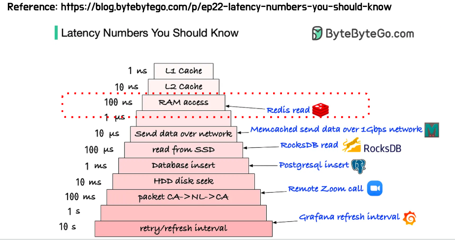

## :pushpin: 가상 면접 사례로 배우는 대규모 시스템 설계 기초


### :seedling: 2장 개략적인 규모 추정

---

- 개략적인 규모 추정: 시스템 용량이나 성능 요구 사항을 개략적으로 추정해보는 것

### 2의 제곱 수
- 최소 단위는 1바이트이고, 8비트로 구성된다.
- ASCII 문자 하나가 차지하는 메모리 크기가 1바이트다.

#### 흔히 쓰이는 데이터 볼륨 단위

| 2의 x제곱 | 근사치   | 이름        | 축약형     |
|--------|-------|-----------|---------|
| 10     | 1천    | 1 킬로바이트   | 1KB     |
| 20     | 1백만   | 1 메가바이트   | 1MB     |
| 30     | 10억   | 1 기가바이트   | 1GB     |
| 40     | 1조    | 1 테라 바이트  | 1TB     |
| 50     | 1000조 | 1 페타바이트   | 1PB     | 


#### 모든 프로그래머가 알아야할 응답 지연값
- 구글의 제프 딘은 2010년에 통상적인 컴퓨터에서 구현된 연산들의 응답 지연값을 공개한 바 있다. 몇가지 추려보면

```text
L1 캐시 참조: 0.5ns
L2 캐시 참조: 0.7ns
뮤텍스(mutex) 락 / 언락: 100ns
주 메모리 참조: 100ns
1Gbps 네트워크로 2KB 전송: 20,000ns = 20us
메모리에서 1MB 순차적으로 read: 250,000ns = 250us
디스크 탐색(seek): 10,000,000ns = 10ms
네트워크에서 1MB 순차적으로 read = 10,000,000ns=10ms
디스크에서 1MB 순차적으로 read = 30,000,000ns = 30ms 
```



- 위 제시된 수치들을 분석하면 다음과 같은 결론이 나온다.
  - 메모리는 빠르지만 디스크는 아직도 느리다.
  - 디스크 탐색(seek)은 가능한 한 피하라.
  - 단순한 압축 알고리즘은 빠르다.
  - 데이터를 인터넷으로 전송하기 전에 가능하면 압축하라
  - 데이터 센터는 보통 여러 지역(region)에 분산되어 있고 센터들 간에 데이털르 주고 받는데 시간이 걸린다.


### 가용성에 관계된 수치들
- 고가용성은 시스템이 오랜 시간동안 지속적으로 중단없이 운영될 수 있는 능력
- 대부분의 서비스는 99% ~ 100% 사이의 값을 갖는다.


#### 예제: 트위터 QPS와 저장소 요구량 추정
- 연습용 수치이다.

#### 가정
1. 월간 능동 사용자는 3억명
2. 50%의 사용자가 트위터를 매일 사용한다
3. 평균적으로 각 사용자는 매일 2건의 트윗을 올린다
4. 미디어를 포함하는 트윗은 10% 정도다
5. 데이터는 5년간 보관된다

#### 추정
QPS(Query Per Second) 추정치
1. 일간 능동 사용자 = 3억 x 50% = 1.5억
2. QPS = 1.5억 x 2트윗 / 24시간 / 3600초 = 약 3500
3. 최대 QPS = 2 x QPS = 약 7000

미디어 저장을 위한 저장소 요구량
1. 평균 트윗 크키
- tweet_id에 64바이트 
- 텍스트에 140 바이트
- 미디어에 1MB 

2. 미디어 저장소 요구량: 1.5억 x 2 x 10% x 1MB = 30TB / 일
3. 5년간 미디어를 보관하기 위한 저장소 요구량: 30TB x 365 x 5 = 약 55PB