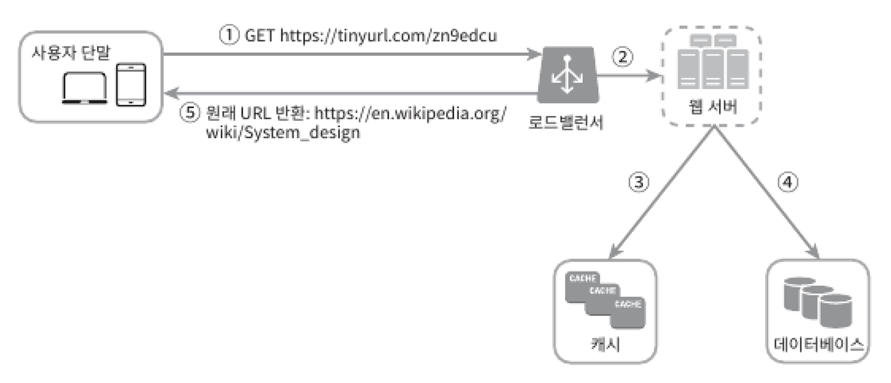

# :pushpin: 8장. URL 단축키 설계

tiny url 같은 URL 단축키를 설계해보자

1. URL 단축: 주어진 긴 URL을 훨씬 짧게 줄인다.
2. URL 리디렉션: 축약된 URL로 HTTP 요청이 오면 원래 URL로 안내
3. 높은 가용성과 규모 확장성, 장애 감내


## 2단계: 개략적 설계안 제시 및 동의 구하기

1. URL 단축용 엔드포인트

```text
POST /api/v1/data/shorten

인자: {longUrl: longURLString}
반환: 단축 URL
```

2. URL 리디렉션용 엔드포인트
```text
GET /api/v1/shorten

반환: HTTP 리디렉션 목적지가 될 원래 URL
```


#### URL 리디렉션
#### 301 Permanently Moved
- 응답의 Location 헤더에 리디렉션 할 URL 제공
- 브라우저는 이 응답을 캐시하여 재요청시 브라우저 캐시 사용

##### 302 Found
- 응답의 Location 헤더에 리디렉션 할 URL 제공
- 브라우저는 이 응답을 캐시하지 않아 재요청 발생
- 트래픽 분석이 중요할때의 선택지


## 3단계: URL 단축키 상세 설계
1. 입력으로 긴 URL을 받는다.
2. 데이터베이스에 해당 URL이 있는지 검사한다.
3. 데이터베이스에 있다면 해당 URL에 대한 단축 URL을 만든 적이 있는 것이다. 따라서 데이터베이스에서 해당 단축 URL을 가져와서 클라이언트에게 반환한다.
4. 데이터베이스에 없는 경우에는 해당 URL은 새로 접수된 것이므로 유일한 ID를 생성한다. 이 ID는 데이터베이스의 기본 키로 사용된다.
5. 62진법 변환을 적용, ID를 단축 URL로 만든다.
6. ID, 단축 URL, 원래 URL로 새 데이터베이스 레코드를 만든 후 단축 URL을 클라이언트에 전달한다.

