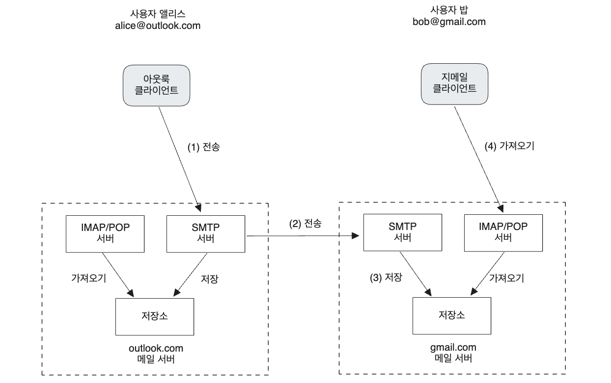
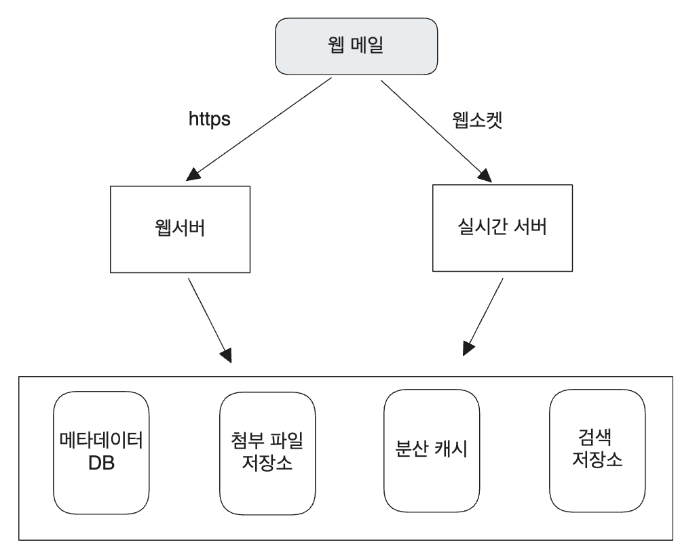
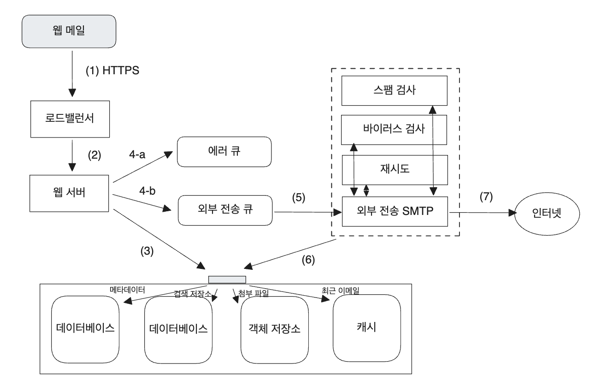

# 8장 분산 이메일 서비스

## 1. 문제 이해 및 설계 범위 확정

### 기능 요구사항
- 이메일 발송/수신
- 모든 이메일 가져오기
- 읽음 여부에 따른 이메일 필터링
- 제목, 발신일, 메일 내용에 따른 검색 기능
- 스팸 및 바이러스 방지 기능

### 비기능 요구사항
- 안정성
- 가용성
- 확장성
- 유연성과 확장성

### 개략적인 규모 추정
- 10억 명의 사용자
- 이메일 전송 QPS = 100,000 (10^9 * 10 / 10^5)
    - 한 사람이 하루에 보내는 평균 이메일 수는 10건으로 가정

- 1년간 스토리지 요구사항 = 730PB (10억 명 * 하루 40건 * 365일 * 50KB)
    - 한 사람이 하루에 수신하는 이메일 수는 평균 40건으로 가정
    - 이메일 하나의 메타데이터는 평균 50KB로 가정

- 1년간 필요한 저장 용량 = 1,460PB (10억 명 * 하루 40건 * 365일 * 20% * 500KB)
    - 첨부 파일을 포함하는 이메일의 비율은 20%로 가정
    - 첨부 파일의 평균 크기는 500KB로 가정

## 2. 개략적 설계안 제시 및 동의 구하기

### 이메일 101
#### 이메일 프로토콜
- SMTP: 이메일을 한 서버에서 다른 서버로 보내는 표준 프로토콜
- POP, IMAP: 이메일을 가져오는 목적으로 가장 널리 사용되는 프로토콜
    - POP: 이메일을 읽으려면 파일 전부를 다운로드 받아야 함
    - IMAP: 클릭하지 않으면 메시지는 다운로드 되지 않음
- HTTPS: 웹 기반 이메일 시스템의 메일함 접속에 이용

#### 도메인 이름 서비스(DNS)
- DNS 서버는 수신자 도메인의 메일 교환기 레코드 검색에 이용된다.

#### 첨부 파일
- 이메일 메시지와 함께 전송되며 일반적으로 Base64 인코딩을 사용한다.

### 전통적 메일 서버
- 보통 서버 한 대로 운용된다.
- 사용자가 많지 않을 때 잘 동작한다.

#### 전통적 메일 서버 아키텍처

1. 앨리스는 아웃룩 클라이언트에 로그인하여 이메일을 작성하고 `보내기` 버튼을 누른다. 이메일은 아웃룩 메일 서버로 전송된다. 아웃룩 클라이언트와 메일 서버 사이의 통신 프로토콜은 SMTP이다.
2. 아웃룩 메일 서버는 DNS 질의를 통해 수신자 SMTP 서버 주소를 찾는다. 주소를 얻은 후 해당 메일 서버로 이메일을 보낸다. 메일 서버 간 통신 프로토콜도 SMTP다.
3. 지메일 서버는 이메일을 저장하고 수신자인 밥이 읽어갈 수 있도록 한다.
4. 밥이 지메일에 로그인하면 지메일 클라이언트는 IMAP/POP 서버를 통해 새 이메일을 가져온다.

#### 저장소
- 전통적 메일 서버는 이메일을 파일 시스템의 디렉터리에 저장한다.
- 사용자가 늘어나면서 더 안정적인 분산 데이터 저장소 계층이 필요했다.

### 분산 메일 서버
- 현대적 사용 패턴을 지원하고 확장성과 안정성 문제를 해결한다.

#### 이메일 API
- POST /v1/messages 엔드포인트: 수신자에게 메시지 전송
- GET /v1/folders 엔드포인트: 주어진 이메일 계정에 존재하는 모든 폴더 반환
- GET /v1/folders/{:folder_id}/messages 엔드포인트: 주어진 폴더 아래의 모든 메시지 반환
- GET /v1/messages/{:message_id} 엔드포인트: 주어진 특정 메시지에 대한 모든 정보 반환

#### 분산 메일 서버 아키텍처

- 웹메일: 사용자는 웹브라우저를 사용해 메일을 받고 보낸다.
- 웹서버: 사용자가 이용하는 요청/응답 서비스
- 실시간 서버: 새로운 이메일 내역을 클라이언트에 실시간으로 전달한다.
- 메타데이터 데이터베이스: 메타데이터 저장 DB
- 첨부 파일 저장소: 객체 저장소(아마존 S3) 사용
- 분산 캐시: 최근에 수신된 이메일 캐싱
- 검색 저장소: 분산 문서 저장소

### 이메일 전송 절차

1. 사용자가 웹메일 환경에서 메일 작성 후 전송 버튼을 누른다.
2. 로드밸런서는 처리율 제한 한도를 넘지 않는 선에서 요청을 웹 서버로 전달한다.
3. 웹 서버는 다음 역할을 담당한다.
    - 기본적인 이메일 검증
    - 수신자 이메일 주소 도메인이 송신자 이메일 주소 도메인과 같은지 검사

4. 메시지 큐
    - 4-a. 기본적인 검증에 실패한 이메일은 에러 큐에 보관
    - 4-b. 기본적인 검증을 통과한 이메일은 외부 전송 큐로 전달

5. 외부 전송 담당 SMTP 작업 프로세스는 외부 전송 큐에서 메시지를 꺼내어 이메일의 스팸 및 바이러스 감염 여부 확인
6. 검증 절차를 통과한 이메일은 저장소 계층 내의 `보낸 편지함`에 저장된다.
7. 외부 전송 담당 SMTP 작업 프로세스가 수신자의 메일 서버로 메일을 전송

### 이메일 수신 절차

1. 이메일이 SMTP 로드밸런서에 도착한다.
2. 로드밸런서는 트래픽을 여러 SMTP 서버로 분산한다.
3. 이메일의 첨부 파일이 큐에 들어가기 너무 큰 경우 첨부 파일 저장소에 보관한다.
4. 이메일을 수신 이메일 큐에 넣는다.
5. 메일 처리 작업 프로세스는 스팸 메일을 걸러내고 바이러스를 차단하는 등의 다양한 역할을 한다.
6. 이메일을 메일 저장소, 캐시, 객체 저장소 등에 보관한다.
7. 수신자가 온라인 상태일 경우 이메일을 실시간 서버로 전달한다.
8. 실시간 서버는 수신자 클라이언트가 새 이메일을 실시간으로 받을 수 있도록 하는 웹소켓 서버다.
9. 오프라인 상태 사용자의 이메일은 저장소 계층에 보관한다.
10. 웹 서버는 새로운 이메일을 저장소 계층에서 가져와 클라이언트에 반환한다.

## 3. 상세 설계

### 메타데이터 데이터베이스

#### 이메일 메타데이터의 특성
- 이메일의 헤더는 작고, 빈번히 이용된다.
- 사용 빈도가 낮다.
- 관련된 사용자만 이메일을 읽을 수 있어야 한다.
- 데이터의 신선도는 데이터 사용 패턴에 영향을 미친다.
- 데이터의 높은 안정성이 보장되어야 한다.

#### 올바른 데이터베이스의 선정
- 관계형 데이터베이스: 이메일을 효율적으로 검색할 수 있음
- 분산 객체 저장소: 백업 데이터를 보관하기에는 좋지만, 부가기능을 구현하기에는 좋지 않음
- NoSQL 데이터베이스: 내부 구현이 잘 알려져있지 않음
- 결론, 자체적인 시스템을 만들어 많이 사용함

#### 데이터 모델
- 파티션 키: 데이터를 여러 노드에 분산하는 구실
- 클러스터 키: 같은 파티션에 속한 데이터를 정렬하는 구실
- 사용되는 질의는 다음과 같다.
    - 특정 사용자의 모든 폴더 질의
    - 특정 폴더에 속한 모든 이메일 표시
    - 이메일 생성/삭제/수신
    - 읽은, 또는 읽지 않은 모든 메일

#### 일관성 문제
- 장애가 발생하면 클라이언트는 다른 사본을 통해 주 사본이 복원될 때까지 동기화/갱신 작업을 완료할 수 없다.
- 데이터 일관성을 위해 가용성을 희생한다.

### 이메일 전송 가능성
- 전용 IP: 이메일을 보낼 때 전용 IP를 사용하는 것이 좋다.
- 범주화: 범주가 다른 이메일은 다른 IP 주소를 통해 보내는 것이 좋다.
- 발신인 평판: 새로운 이메일 서버의 IP 주소는 사용 빈도를 서서히 올리는 것이 좋다.
- 스팸 발송자의 신속한 차단: 스팸을 뿌리는 사용자를 신속히 차단한다.
- 피드백 처리: ISP 측에서의 피드백을 쉽게 받아 처리할 수 있는 경로를 만드는 것이 중요하다.
- 이메일 인증: ISP와 좋은 관계를 유지할 필요가 있다.

### 검색
- 이메일 시스템의 검색 기능에서는 쓰기 연산이 읽기 연산보다 훨씬 많이 발생한다.

#### 방안1: ElasticSearch
- 사용자는 검색 버튼을 누른 후 다음 결과가 수신될 때까지 기다린다. (동기 방식)
- ElasticSearch는 이메일 검색에 필요한 텍스트 기반 검색을 잘 지원한다.
- 주 이메일 저장소와 동기화를 맞추는 부분이 까다롭다.

#### 방법2: 맞춤형 검색 솔루션
- 대규모 이메일 서비스 사업자는 보통 자기 제품에 고유한 요구사항을 만족시키기 위해 검색 엔진을 자체적으로 개발해 사용한다.

### 규모 확장성 및 가용성
- 시스템의 대부분 컴포넌트는 수평적으로 규모 확장이 가능할 것으로 기대할 수 있다.
- 가용성을 향상시키기 위해 데이터를 여러 데이터센터에 다중화하는 것이 필요하다.

## 4. 마무리
- 결함 내성
- 규정 준수
- 보안
- 최적화